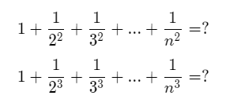
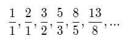

# IFCEN MATH LIST

本清单根据IFCEN的数学教学，提出相应的拓展和问题探讨。

- 欢迎将本任务列表中完成的文章/程序提交，以Pull Request的形式进行提交

- 欢迎提出你的题目/新想法

## Semestre 1
### 1. Intro calculus
- [ ] 写篇小文章谈谈你对微积分/极限的思考吧
  - [video: What they won't teach you in calculus](https://www.youtube.com/watch?v=CfW845LNObM)
### 2. Functions
- [ ] 可视化你喜欢的函数，另外思考，如何可视化复函数？（至少需要两个平面，一个定义域，一个值域）
  - [Chap3:The Complex Exponential Function](https://www.coursera.org/learn/complex-analysis#syllabus)
### 3. Complex number
- [ ] 写篇小文章介绍复数的起源吧
  - [video: imaginary numbers are real](https://www.youtube.com/watch?v=T647CGsuOVU)
  - [course chap1:introduction to complex number](https://www.coursera.org/learn/complex-analysis#syllabus)
### 4. Differential equation
- [ ] 微分方程的相关应用，可以是文章/小程序
  - [video: Differential equations, studying the unsolvable](https://www.youtube.com/watch?v=p_di4Zn4wz4)
  - [article: python solve ODE](https://apmonitor.com/pdc/index.php/Main/SolveDifferentialEquations)

## Semestre 2
### 1.Groupes, anneaux et corps
- [ ] 为什么要学群论呢？谈谈你的看法：群论有什么用
  - [article:why groups?](https://kconrad.math.uconn.edu/blurbs/grouptheory/whygroups.pdf)
  - [article: about group](https://zhuanlan.zhihu.com/p/157126167)
### 2.Relations et ensembles N,Z,R
- [ ] 平方倒数求和等于多少？立方倒数求和等于多少？探索一下
  
- [ ] Dürer's Magic Square(幻方)这张图右边是丢勒的一个版画作品，最底行中间是1514，是他母亲去世的年份。尝试自己推导这个4x4幻方
- [ ] 知乎上关于稠密性有这么个比喻“一碗粥里面放满了香菜，如果你能一勺舀下去（勺的大小，舀的方式随你便），能够舀出一勺没有香菜的粥，就说明香菜在粥里面不是稠密的；如果你怎么都做不到这一点，就说明香菜在粥里面是稠密的。”你怎么看？如何证明有理数/无理数的稠密性？
### 3.Suites réelles ou complexes
- [ ] 下列渐近分数有什么规律，极限是什么 
  
# Semestre 3
待补充