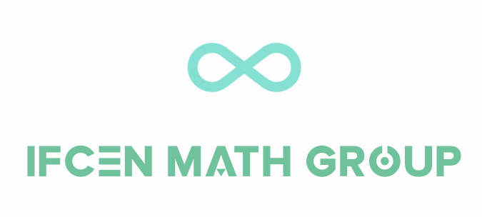
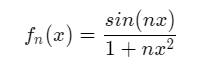
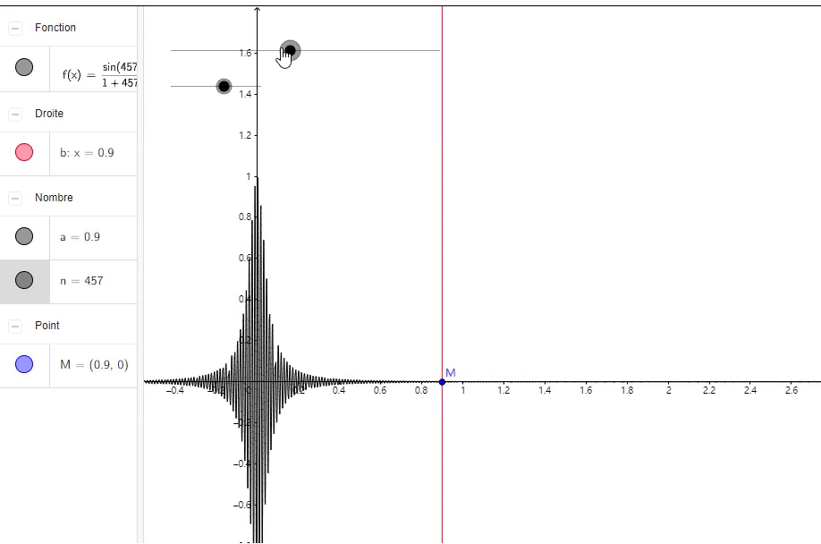
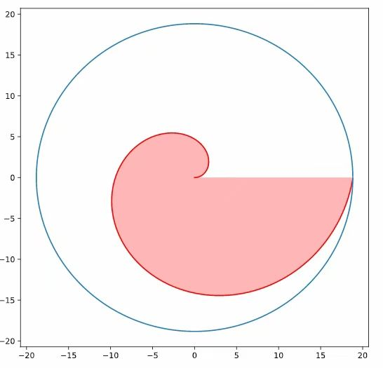
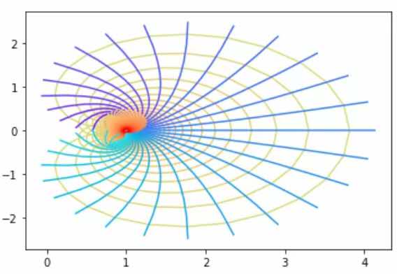
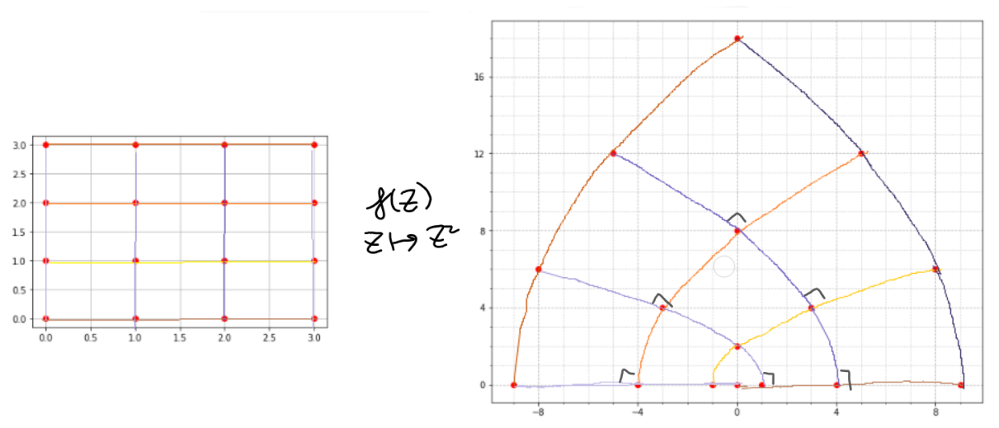

# IFCEN Math Group

“法国数学为什么如此强大？”巴黎人回答,“我们最优秀的人学习数学。IFCEN的数学培养采用法国工程师体系进行培养，具有数学教育的先天优势，我们可以直接接触优秀的法语数学资源。但是，部分IFCENers在繁忙的课业中无法欣赏数学之美，部分学生学习的数学知识考后即忘。

我们希望通过IFCEN数学小组:
- 带动IFCEN学生的数学学习积极性
- 拓展数学视野，探索美妙的数学世界
- 与编程和应用结合，学以致用
- 提供一个平台，让数学爱好者交流讨论，碰撞思维的火花
- 提高IFCEN的影响力，形成IFCEN数学社群

## **可视化，math更直观**
## convergence simple? convergence uniforme?

## Archimede spiral

## Riemann zeta function

## complex z square mapping

## 数学问题探讨
完成的文章/程序请提交到本项目，以Pull Request的形式进行提交
## Semestre 1
- [ ] 写篇小文章谈谈你对微积分/极限的思考吧
- [ ] 可视化你喜欢的函数，另外思考，如何可视化复函数？（至少需要两个平面，一个定义域，一个值域）
  - [Chap3:The Complex Exponential Function](https://www.coursera.org/learn/complex-analysis#syllabus)
## Semestre 2
- [ ] 平方倒数求和等于多少？立方倒数求和等于多少？探索一下

  
- [ ] 下列渐近分数有什么规律，极限是什么 

  
- [ ] 为什么要学群论呢？谈谈你的看法：群论有什么用
  - [article:why groups?](https://kconrad.math.uconn.edu/blurbs/grouptheory/whygroups.pdf)
  - [article: about group](https://zhuanlan.zhihu.com/p/157126167)

更多小任务清单请见: [ifcen_math_list](ifcen_math.md)
## 数学知识体系梳理：
- [数学知识体系梳理](math_tree_CN.md)
- [英文版](math_tree.md)
- [法文版]待补充
## 数学读物分享：
- 《从一到无穷大》
- 《素数之恋》
- [数学读物分享(附网盘链接)](https://github.com/lyuchuny3/IFCEN_Math_Group/wiki)
- ...
## 数学家故事
- 法国数学家 xxx (欢迎补充)

## Wiki
- 数学软件
- 动图gif制作
- ...
详情见(https://github.com/lyuchuny3/IFCEN_Math_Group/wiki)

## IFCEN Math Group年级负责人（招募中）
- 负责向全年级的同学推广IFCEN数学小组
- 后期将举办线下数学交流活动，负责活动的组织通知推广
---------------------------------------
- 10级：
- 11级：
- 12级：
- 13级：
- 14级：
- 15级：
- 16级：
- 17级：
- 18级：
- 19级：
- 20级：
  
## 后续计划:
* 创办IFCEN数学小组公众号（招募公众号运营）
* 线下交流活动
